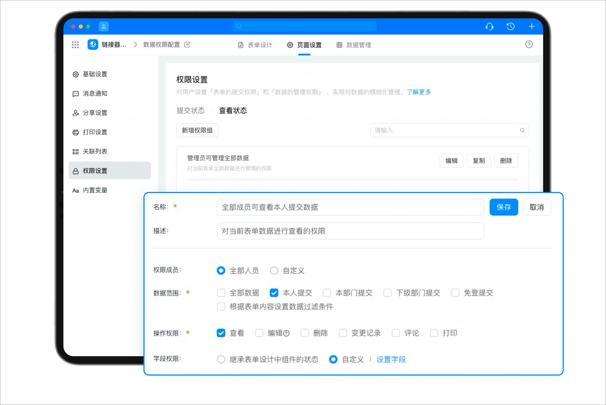
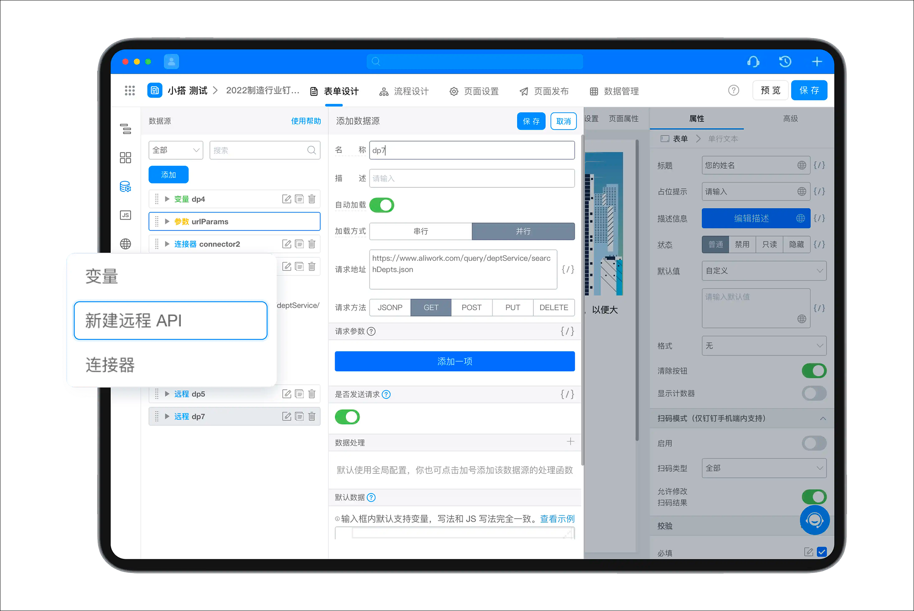

# 产品功能介绍 | 钉钉宜搭·帮助中心

在当今信息化的时代，应用程序的灵活性和适应性对于企业来说尤为重要。因此，选择一个能够支持多种应用场景和业务模式的平台变得尤为关键。宜搭就是这样一款能够满足企业需求的应用搭建平台，本文介绍宜搭的产品基本功能。

📌因宜搭帮助手册经历多次更新，若需查看旧版帮助手册，[请点击此处查看。](https://pre-docs.aliwork.com/docs/yida_qalist/uw8g7tx57vgg5mq1)

## 核心优势

宜搭的核心优势是，其基于阿里云的云基础设施和钉钉的企业数字化操作系统，可以轻易地为每个组织提供低门槛、高效率的数字化业务应用生产新模式。在宜搭上生产的每个应用都天然具备互联互通、数据驱动和安全可靠的特点。

| 核心优势 | 说明 |
|---------|------|
| 易连接 | 200+高频连接器，从线下到线上，深度连接阿里云与钉钉，消除企业数据孤岛，助力传统软件现代化。 |
| 酷数据 | 亿级数据能力，更低的数据BI门槛，企业业务数据全面打通，一键拥有数字化大屏。 |
| 强扩展 | 全面开放组件、服务、页面定制和Open API，具有更强的扩展能力让构建变简单。 |
| 更安全 | 通过阿里云安全底座及混合云存储架构，提供存储安全、业务安全、数据管控等全方位安全保障。 |

## 核心能力

宜搭的核心能力分为基础能力、体系能力、开放连接和高扩展性四个部分，你可以参考以下内容了解宜搭的核心能力。

### 基础能力

宜搭基础能力提供了灵活的表单搭建能力、数字化的企业审批流程和丰富的数据处理及图表能力。你可以使用宜搭基础能力快速的搭建个性化应用。

- **表单能力** 为你提供了丰富的字段类型，通过数据联动，关联表单，公式运算等能力，实现灵活的低代码可视化设计和页面搭建的功能。其中表单搭建能力分为普通表单和流程表单两种。
  - 普通表单通常用于数据收集和事件跟进。
  - 流程表单通常用于业务审批和任务协同。

- **审批流程** 提供了丰富流程设计能力，支持流程节点新增、删除、编辑、配置节点审批人、审批规则、条件设置、节点动作等。

- **宜搭报表** 提供了丰富的数据图表和数据处理能力，高效的可视化方案能为客户提供数据分析和洞察价值。

### 体系能力

使用宜搭创建的应用还支持打通钉钉组织架构，配置灵活高效的权限管控体系。并且还支持发送钉钉消息通知的能力。

- **权限管理能力** 提供了权限自定义配置，满足灵活高效性的要求，分层分级的权限管理体系，保障权责一致，数据安全的一体化管控。

- 通过打通钉钉组织架构及关联组织，实现钉钉组织内的角色，流程，数据，消息等互通，支持跨组织业务协同。

- 通过深度整合钉钉的消息能力，使应用支持工作通知、待办、快捷卡片消息、邮件等多种灵活通知方式，满足各种业务场景。

### 开放连接

打通阿里云和钉钉的底层能力和技术，将企业原有系统与钉钉连接，降低企业数字化门槛。

**强大的连接器能力**

- 可连接钉钉一方能力，如工作通知、待办、考勤等。同时支持自定义连接器， 实现钉钉宜搭与生态或三方应用的资源数据打通。
- 宜搭平台为用户、生态伙伴开放openAPI，操作宜搭数据，灵活构建应用。

### 更多扩展性

宜搭具有出色的可扩展性和易维护性。它可以与阿里云其他产品无缝集成，实现数据共享和协同办公。同时，宜搭还支持自定义业务流程和数据字段，提供更加灵活的业务流程管理和优化方案。

---

## 历史文档（停止维护）

- [购买指南](https://docs.aliwork.com/docs/yida_support/uw8g7tx57vgg5mq1/iif7ge)
- [基础概念](https://docs.aliwork.com/docs/yida_support/uw8g7tx57vgg5mq1/li89l7)
- [I日-付贵功能](https://docs.aliwork.com/docs/yida_support/uw8g7tx57vgg5mq1/lmvsctyt7rxtgsrq)
- [智能问答](https://docs.aliwork.com/docs/yida_support/uw8g7tx57vgg5mq1/acw45zugyx9bz7yn)
- [宜搭数据连接指南](https://docs.aliwork.com/docs/yida_support/uw8g7tx57vgg5mq1/pk4mrn)
- [一图看懂宜搭](https://docs.aliwork.com/docs/yida_support/uw8g7tx57vgg5mq1/gc4xqz4da954lhsg)
- [宜搭2级网络域名的升级公告](https://docs.aliwork.com/docs/yida_support/uw8g7tx57vgg5mq1/tyrgag)
- [平台管理](https://docs.aliwork.com/docs/yida_support/uw8g7tx57vgg5mq1/cmggzu)
- [应用管理](https://docs.aliwork.com/docs/yida_support/uw8g7tx57vgg5mq1/uop0b0ndpgc0gevb)
- [表单管理](https://docs.aliwork.com/docs/yida_support/uw8g7tx57vgg5mq1/sk2s4ft0ic8tdqzn)
- [2.0报表组件（停止维护）](https://docs.aliwork.com/docs/yida_support/uw8g7tx57vgg5mq1/yxgxg6)
