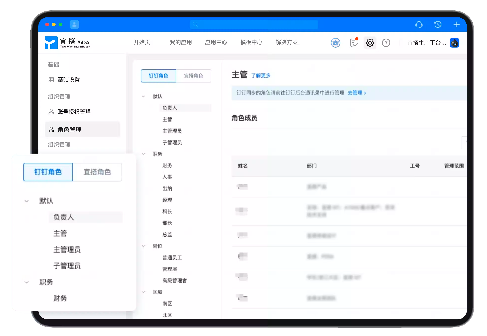
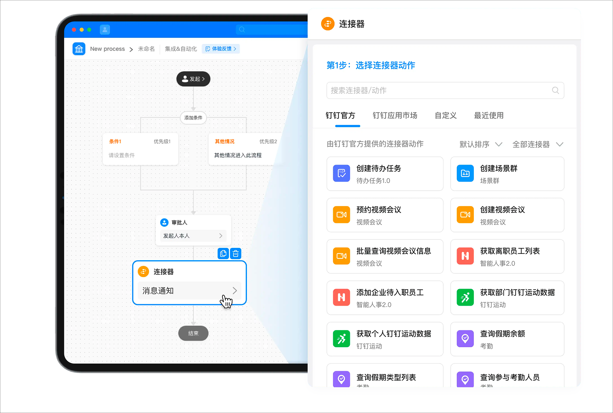

# Product Introduction | DingTalk YiDa Help Center

In today's information age, the flexibility and adaptability of applications are particularly important for enterprises. Therefore, choosing a platform that can support multiple application scenarios and business models becomes crucial. YiDa is such an application building platform that can meet enterprise needs. This article introduces the basic functions of YiDa.

📌 Due to multiple updates to the YiDa help manual, [click here](https://pre-docs.aliwork.com/docs/yida_qalist/uw8g7tx57vgg5mq1) to view the old version.

## Core Advantages

YiDa's core advantage is that based on Alibaba Cloud's infrastructure and DingTalk's enterprise digital operating system, it can easily provide each organization with a new model of low-code, high-efficiency digital business application production. Every application produced on YiDa naturally has the characteristics of interconnection, data-driven, and secure.

| Core Advantage | Description |
|---------------|-------------|
| Easy Connect | 200+ high-frequency connectors, from offline to online, deeply connecting Alibaba Cloud and DingTalk, eliminating enterprise data silos, and helping modernize traditional software. |
| Data Analytics | Billions of data capabilities, lower data BI thresholds, comprehensive enterprise business data integration, one-click digital dashboard. |
| Strong Extension | Fully open components, services, page customization, and Open API, with stronger extension capabilities to simplify building. |
| More Secure | Provides comprehensive security guarantees including storage security, business security, and data control through Alibaba Cloud security foundation and hybrid cloud storage architecture. |

## Core Capabilities

YiDa's core capabilities are divided into four parts: basic capabilities, system capabilities, open connections, and high extensibility. You can refer to the following to understand YiDa's core capabilities.

### Basic Capabilities

YiDa basic capabilities provide flexible form building, digitized enterprise approval processes, and rich data processing and charting capabilities. You can use YiDa basic capabilities to quickly build personalized applications.

- **Form Capabilities** provide rich field types, with data linkage, form associations, formula calculations, and other capabilities to achieve flexible low-code visual design and page building. Form building capabilities include regular forms and process forms.
  - Regular forms are typically used for data collection and event tracking.
  - Process forms are typically used for business approval and task collaboration.

- **Approval Process** provides rich process design capabilities, supporting process node addition, deletion, editing, node approver configuration, approval rules, condition settings, node actions, and more.

- **YiDa Reports** provide rich data charts and data processing capabilities. Efficient visualization solutions can provide customers with data analysis and insight value.

### System Capabilities

Applications created with YiDa also support integration with DingTalk organizational structure, flexible and efficient permission control systems, and the ability to send DingTalk notifications.

- **Permission Management** provides customizable permission configuration, meeting flexible and efficient requirements with layered and graded permission management systems to ensure consistent rights and responsibilities and integrated data security control.

- Through integration with DingTalk organizational structure and associated organizations, achieve interoperability of roles, processes, data, and messages within DingTalk organizations, supporting cross-organizational business collaboration.

- Through deep integration of DingTalk's messaging capabilities, applications support work notifications, to-dos, quick card messages, emails, and other flexible notification methods to meet various business scenarios.

### Open Connection

Connect Alibaba Cloud and DingTalk's underlying capabilities and technologies, connecting enterprise original systems with DingTalk to lower enterprise digital thresholds.

**Powerful Connector Capabilities**

- Can connect DingTalk's first-party capabilities such as work notifications, to-dos, attendance, etc. Also supports custom connectors to achieve resource data integration between YiDa and ecosystem or third-party applications.
- YiDa platform provides open APIs for users and ecosystem partners to operate YiDa data and flexibly build applications.

### More Extensibility

YiDa has excellent extensibility and maintainability. It can seamlessly integrate with other Alibaba Cloud products to achieve data sharing and collaborative office. At the same time, YiDa also supports custom business processes and data fields, providing more flexible business process management and optimization solutions.

---

## Historical Documents (Discontinued)

- [Purchase Guide](https://docs.aliwork.com/docs/yida_support/uw8g7tx57vgg5mq1/iif7ge)
- [Basic Concepts](https://docs.aliwork.com/docs/yida_support/uw8g7tx57vgg5mq1/li89l7)
- [I-Day Payment Features](https://docs.aliwork.com/docs/yida_support/uw8g7tx57vgg5mq1/lmvsctyt7rxtgsrq)
- [Intelligent Q&A](https://docs.aliwork.com/docs/yida_support/uw8g7tx57vgg5mq1/acw45zugyx9bz7yn)
- [YiDa Data Connection Guide](https://docs.aliwork.com/docs/yida_support/uw8g7tx57vgg5mq1/pk4mrn)
- [YiDa at a Glance](https://docs.aliwork.com/docs/yida_support/uw8g7tx57vgg5mq1/gc4xqz4da954lhsg)
- [YiDa Level 2 Domain Name Upgrade Notice](https://docs.aliwork.com/docs/yida_support/uw8g7tx57vgg5mq1/tyrgag)
- [Platform Management](https://docs.aliwork.com/docs/yida_support/uw8g7tx57vgg5mq1/cmggzu)
- [Application Management](https://docs.aliwork.com/docs/yida_support/uw8g7tx57vgg5mq1/uop0b0ndpgc0gevb)
- [Form Management](https://docs.aliwork.com/docs/yida_support/uw8g7tx57vgg5mq1/sk2s4ft0ic8tdqzn)
- [2.0 Report Components (Discontinued)](https://docs.aliwork.com/docs/yida_support/uw8g7tx57vgg5mq1/yxgxg6)
